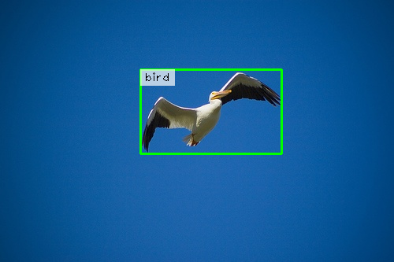
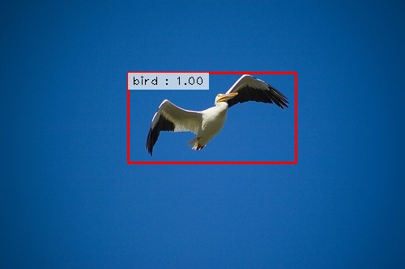
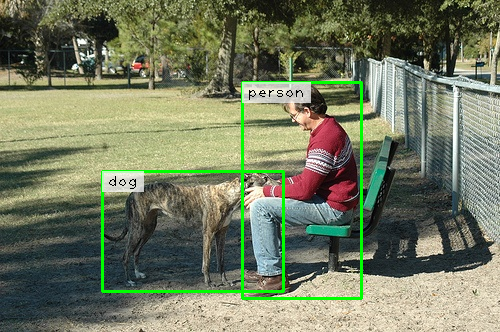
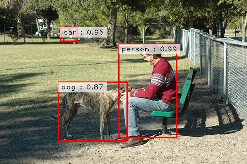

# Faster R-CNN Implementation from Scratch

This repository implements [Faster R-CNN](https://arxiv.org/abs/1506.01497) from scratch in PyTorch for object detection. The implementation is designed to be educational and easy to understand, providing a clean, well-documented codebase that demonstrates the core concepts of Faster R-CNN without excessive abstractions.

## Sample Output by training Faster R-CNN on VOC 2007 dataset 
Ground Truth(Left) | Prediction(right)
</br>


</br>



## 🚀 Key Features

- **From Scratch Implementation**: Clean, educational implementation of Faster R-CNN architecture
- **VGG16 Backbone**: Uses VGG16 (pre-trained on ImageNet) as the feature extractor
- **Complete Training Pipeline**: Full training loop with loss computation and optimization
- **Inference & Evaluation**: Comprehensive inference pipeline with mAP evaluation
- **VOC 2007 Dataset Support**: Ready-to-use dataset loader for PASCAL VOC 2007
- **Configurable Architecture**: YAML-based configuration system for easy experimentation
- **Sample Outputs**: Visualization of predictions vs ground truth

## 🏗️ Architecture Overview

The implementation consists of three main components:

### 1. Backbone Network (VGG16)
- Pre-trained VGG16 feature extractor (removing final max pooling and classification layers)
- First 10 layers frozen for stability
- Outputs 512-channel feature maps

### 2. Region Proposal Network (RPN) 
- Generates object proposals from feature maps
- Uses 9 anchors per spatial location (3 scales × 3 aspect ratios)
- **Scales**: [128, 256, 512] pixels
- **Aspect Ratios**: [0.5, 1.0, 2.0] (height/width)
- Outputs objectness scores and bounding box refinements

### 3. ROI Head
- Classifies proposals and refines bounding boxes
- ROI pooling with 7×7 output size
- Two fully connected layers (FC6, FC7) with 1024 dimensions
- Final classification and regression heads

## 📁 Project Structure

```
Faster-R-CNN/
├── model/
│   ├── faster_rcnn.py      # Main Faster R-CNN model
│   ├── rpn.py              # Region Proposal Network
│   ├── roi_head.py         # ROI Head for 
│   └── utils.py            # Utility functions (IoU, NMS, etc.)
├── dataset/
│   └── voc.py              # VOC dataset loader
├── tools/
│   ├── train.py            # Training script
│   └── infer.py            # Inference and evaluation script
├── config/
│   └── voc.yaml            # Configuration file for VOC training
└── requirements.txt        # Dependencies
```

## 🛠️ Installation

### Prerequisites
- Python 3.12+
- CUDA-capable GPU (recommended)

### Setup Environment

1. **Clone the repository**:
```bash
git clone https://github.com/ggnery/Faster-R-CNN.gitFaster-R-CNN.git
cd Faster-R-CNN
```

2. **Create conda virtual environment**:
```bash
conda create -n faster-rcnn python=3.12
```

3. **Install dependencies**:
```bash
pip install -r requirements.txt
```

## 📊 Data preparation
For setting up the VOC 2007 dataset:
* Download VOC 2007 train/val data from http://host.robots.ox.ac.uk/pascal/VOC/voc2007 and name it as `VOC2007` folder
* Download VOC 2007 test data from http://host.robots.ox.ac.uk/pascal/VOC/voc2007 and name it as `VOC2007-test` folder
* Place both the directories inside the root folder of repo according to below structure
    ```
    Faster-R-CNN
        -> VOC2007
            -> JPEGImages
            -> Annotations
        -> VOC2007-test
            -> JPEGImages
            -> Annotations
    ```

## Configuration
* ```config/voc.yaml``` - Allows you to play with different components of faster r-cnn on voc dataset  

## 🚀 Quick Start

### Training

Train the Faster R-CNN model on VOC 2007:

```bash
python tools/train.py --config config/voc.yaml
```

### Inference

Generate predictions on test images and Evaluate mAP on test dataset:

```bash
python tools/infer.py --config config/voc.yaml --infer_samples True --evaluate True
```


## 📈 Results

The model generates visual comparisons between ground truth and predictions:

- **Ground Truth**: `samples/output_frcnn_gt_*.png`
- **Predictions**: `samples/output_frcnn_*.jpg`


## 📋 Implementation Details

### Key Differences from Paper
- **Single batch size**: Optimized for batch size of 1
- **FC layer dimensions**: Uses 1024-dim FC layers instead of VGG's original
- **ROI pooling**: Single-scale feature maps (no Feature Pyramid Network)

### Training Strategy
- **Gradient accumulation**: Simulates larger batch sizes (default: 5 steps)
- **Multi-step learning rate**: Decreases by 0.1 at epochs 12 and 16
- **Data augmentation**: Horizontal flipping (50% probability)

### Loss Functions
- **RPN losses**: Classification (binary cross-entropy) + regression (smooth L1)
- **ROI losses**: Multi-class classification + class-specific regression
- **Total loss**: Sum of all four loss components


## 📄 License

This project is licensed under the MIT License - see the [LICENSE](LICENSE) file for details.

## 🙏 Acknowledgments

- [Faster R-CNN Paper](https://arxiv.org/abs/1506.01497) by Ren et al.
- PASCAL VOC dataset
- PyTorch community for excellent documentation
- [Explaining AI](https://www.youtube.com/@Explaining-AI) youtube channel
- Jesus Christ and Saint Mary
## 📞 Citation

If you use this implementation in your research, please cite:

```bibtex
@article{ren2015faster,
  title={Faster R-CNN: Towards Real-Time Object Detection with Region Proposal Networks},
  author={Ren, Shaoqing and He, Kaiming and Girshick, Ross and Sun, Jian},
  journal={Advances in Neural Information Processing Systems},
  year={2015}
}
```

## 🐛 Contributing

Contributions are welcome! Please feel free to submit a Pull Request. For major changes, please open an issue first to discuss what you would like to change.